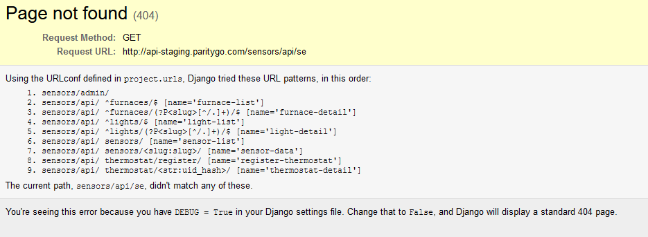
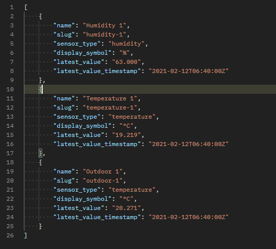

# TODO

These were items on my list that I did not get around to accomplish but had thoughts about:

- Use media query to make app viewable on mobile
- Add API status checks and error messages
- Display outside temperature and humidity levels 
- Unit tests
- Update register button so that it shows successful registration
- Potentially safe keep API links in a secure location to prevent repeated calls and generate overhead
- Implement a slide bar and/or ability to hold down the button to continuously increase/decrease temperature for better UX
- Take into account of other time zones when retrieving current temperature
- Include separate temperature and humidity data into each separate unit
- Change the color of the middle arrow to correspond to heating/cooling
- Implement the temperature increasing/decreasing incrementally to reach the desired temperature. Also ties in with changing the mode once the current temperature has reached the desired temperature

# Completed Items

The following are the items on the description that I completed:
- The user should be able to register their thermostat with our home automation backend.
- When users close their session/browser and open it again, they need to have access to their thermostat that was registered in B (*don’t account for a case when a user decides to clear all local browser data*)
- The user should be able to see the current temperature inside the room.
- The user should be able to switch the thermostat off.
- The user should be able to switch the thermostat to heating mode.
- The user should be able to switch the thermostat to cooling mode.
- The user should be able to set the desired temperature and set the thermostat to auto mode.
- While thermostat is in an auto mode, a user wants to see if it is either:
  - heating if current temp < desired temp 
  - or cooling/stand-by if desired < current
- The thermostat switches between heating and cooling in real time once the current temperature changes.
  - Our engineering team wants to be sure that a user cannot switch thermostat to cooling if the current outside temperature is below 0˚C.
  - Our engineering team wants to be sure that the thermostat goes to stand-by mode instead of cooling if:
    - thermostat is in auto mode 
    - and the current temperature in the room is above the desired temperature set by a user, 
    - and the current outside temperature is below 0˚C

  

# Notes
When trying to query for the API, I noticed that one of the links provided in the description was not making the requests as expected, in particular: http://api-staging.paritygo.com/sensors/api/sensors/humidity?begin=2021-02-12T04:55:24-05:00&end=2021-02-12T05:10:24-05:00. I ended up discovering that there was a typo in the link after debugging through the 404 page on Parity and Postman:

I realized that there was a `<slug:slug>` attribute that wasn't mentioned in the description but showed up in my response from Postman. It turns out the word "humidity" in the API should be "humidity-1" just like the slug. It's a bit late but I wanted to point out the miscommunication for your future interviewees. 

This project was bootstrapped with [Create React App](https://github.com/facebook/create-react-app).

## Available Scripts

In the project directory, you can run:

### `yarn start`

### `yarn build`

Builds the app for production to the `build` folder.\
It correctly bundles React in production mode and optimizes the build for the best performance.

The build is minified and the filenames include the hashes.\
Your app is ready to be deployed!

See the section about [deployment](https://facebook.github.io/create-react-app/docs/deployment) for more information.
